# ⚽ Most Comprehensive Transfermarkt Dataset
### *Comprehensive Football/Soccer Dataset - 93,000+ Players*

[](https://github.com/salimt/football-datasets/blob/main/LICENSE)
[](https://github.com/salimt/football-datasets)
[](https://github.com/salimt/football-datasets)
[](https://github.com/salimt/football-datasets)
[](https://github.com/sponsors/salimt)
[](https://www.kaggle.com/datasets/xfkzujqjvx97n/football-datasets/)

> **Complete football/soccer datalake with 93000+ players from Transfermarkt. Includes player profiles, performance statistics, market values, transfer histories, injury records, national team data, and teammate relationships.**

---

## 📊 **Dataset Coverage**

- **🎯 Total Players**: 92,671 professional football players  
- **⚽ Total Teams**: 2,175 clubs worldwide  
- **🌍 Geographic Scope**: Global coverage of all major leagues  
- **📈 Data Categories**: 10 comprehensive data categories  

---

## 🗂️ **Complete Datalake Structure - all CSV files -**

# Example Data

[Check out a sample of the dataset to get started.](https://github.com/salimt/football-datasets/blob/main/README_data.md)

### **Player Data Categories** (7 categories)
```
datalake/transfermarkt/raw/
├── player_profiles/               
├── player_performances/          
├── player_market_values/         
├── player_transfer_histories/          
├── player_injury_histories/       
├── player_national_team_performances/ 
└── player_teammates_played_with/  
```

### **Team Data Categories** (3 categories)
```
datalake/transfermarkt/raw/
├── teams_details/                 
├── teams_competitions_seasons/    
└── teams_children/                
```

## What You Get (5.7M+ Records!) 🔥

### Player Intelligence (7 datasets)
- **92,671 Player Profiles**  
- **1,878,719 Player Performances**  
- **901,457 Player Market Values**  
- **1,101,440 Player Transfer Histories**  
- **143,195 Player Injury Histories**  
- **92,701 Player National Team Performances**  
- **1,257,342 Player Teammates Played With**  

### Club Data (3 datasets)
- **2,175 Teams Details**  
- **196,378 Teams Competitions Seasons**  
- **7,695 Teams Children**  

### Totals
- **Players Total Count:** 5,467,525  
- **Teams Total Count:** 206,248  
- **All Total Count:** 5,673,773  


## 🏗️ **Complete Data Schema & Entity Relationships**

```mermaid
erDiagram

    PLAYER_PROFILES {
        varchar player_id PK
        varchar player_slug
        varchar player_name
        varchar player_image_url
        varchar date_of_birth_url
        date    date_of_birth
        varchar place_of_birth_country
        varchar place_of_birth
        varchar height
        varchar citizenship_country
        varchar citizenship
        varchar position
        varchar foot
        varchar player_agent_url
        varchar player_agent
        varchar current_club_id FK
        varchar current_club_url
        date    joined
        date    contract_expires
        varchar social_media_url
        varchar social_media
        varchar player_main_position
        varchar player_sub_position
    }

    PLAYER_MARKET_VALUES {
        varchar player_id FK
        bigint  date_unix PK
        int     value
    }

    PLAYER_TRANSFER_HISTORIES {
        varchar transfer_id PK
        varchar player_id FK
        varchar season
        date    date
        varchar date_unformatted
        varchar from_team_id FK
        varchar from_team_url
        varchar from_team_name
        varchar to_team_id FK
        varchar to_team_url
        varchar to_team_name
        int     value_at_transfer
        varchar transfer_fee
    }

    PLAYER_PERFORMANCES {
        varchar player_id FK
        varchar season
        varchar competition_id FK
        varchar competition_url
        varchar competition_name
        varchar team_id FK
        varchar team_url
        varchar team_name
        int     nb_in_group
        int     nb_on_pitch
        int     goals
        int     own_goals
        int     assists
        int     subed_in
        int     subed_out
        int     yellow_cards
        int     second_yellow_cards
        int     direct_red_cards
        int     penalty_goals
        int     minutes_played
        int     goals_conceded
        int     clean_sheets
    }

    PLAYER_TEAMMATES_PLAYED_WITH {
        varchar player_id FK
        varchar teammate_id FK
        varchar player_with_url
        varchar player_with_name
        float   ppg_played_with
        int     joint_goal_participation
        int     minutes_played_with
    }

    PLAYER_INJURY_HISTORIES {
        varchar player_id FK
        varchar season
        varchar injury_reason
        date    from_date PK
        date    end_date
        int     days_missed
        int     games_missed
    }

    PLAYER_NATIONAL_TEAM_PERFORMANCES {
        varchar player_id FK
        varchar team_id FK
        varchar team_url
        varchar team_name
        date    first_game_date PK
        int     matches
        int     goals
    }

    TEAMS_DETAILS {
        varchar club_id PK
        varchar club_slug
        varchar club_name
        varchar logo_url
        varchar country_name
        varchar season_id
        varchar competition_id FK
        varchar competition_slug
        varchar competition_name
        varchar club_division
        varchar source_url
    }

    TEAMS_CHILDREN {
        varchar parent_team_id FK
        varchar parent_team_name
        varchar child_team_id FK
        varchar child_team_name
    }


    TEAMS_COMPETITIONS_SEASONS {
        varchar club_division
        varchar club_id          
        varchar competition_id    
        varchar competition_name
        int season_draws
        int season_goal_difference
        int season_goals_against
        int season_goals_for
        varchar season_id
        boolean season_is_two_point_system
        varchar season_league_competition_id
        varchar season_league_league_name
        varchar season_league_league_slug
        varchar season_league_level_level_name
        int season_league_level_level_number
        varchar season_league_season_id
        int season_losses
        varchar season_manager
        varchar season_manager_manager_id
        varchar season_manager_manager_name
        varchar season_manager_manager_slug
        int season_points
        int season_points_against
        int season_points_for
        int season_rank
        varchar season_season
        int season_total_matches
        int season_wins
        varchar team_name
    }


    COMPETITIONS {
        varchar competition_id PK
        varchar competition_slug
        varchar competition_name
    }

    %% RELATIONSHIPS
    PLAYER_PROFILES ||--o{ PLAYER_MARKET_VALUES : "has values"
    PLAYER_PROFILES ||--o{ PLAYER_TRANSFER_HISTORIES : "has transfers"
    PLAYER_PROFILES ||--o{ PLAYER_PERFORMANCES : "has performances"
    PLAYER_PROFILES ||--o{ PLAYER_TEAMMATES_PLAYED_WITH : "played with"
    PLAYER_PROFILES ||--o{ PLAYER_INJURY_HISTORIES : "has injuries"
    PLAYER_PROFILES ||--o{ PLAYER_NATIONAL_TEAM_PERFORMANCES : "national team"

    TEAMS_DETAILS ||--o{ TEAMS_CHILDREN : "parent/child"
    TEAMS_DETAILS ||--o{ TEAMS_COMPETITIONS_SEASONS : "plays in"
    COMPETITIONS ||--o{ TEAMS_DETAILS : "competition includes teams"

    PLAYER_TRANSFER_HISTORIES }o--|| TEAMS_DETAILS : "from/to team"
    PLAYER_PERFORMANCES }o--|| TEAMS_DETAILS : "performance for team"
    PLAYER_PERFORMANCES }o--|| COMPETITIONS : "performance in comp"
    PLAYER_NATIONAL_TEAM_PERFORMANCES }o--|| TEAMS_DETAILS : "national team"

```



---

# Trends & Dynamics in Football Transfers

Exploratory data analysis project using Python and SQL to investigate transfer market trends, player valuations, and career trajectories in European football.

---

## Repository Structure

All scripts are located in `datalake/transfermarkt/`.

| File | Description |
|------|-------------|
| `db_creation_sqlite3.py` | Loads all CSV files from the dataset into a local SQLite database (`transfermarkt.db`) |
| `queries.sql` | SQL queries for all 10 analytical questions |
| `q1_mkt_value_x_position.py` | Q1–Q3: Market value by position, trend over time, and foot preference analysis |
| `q4_transfers_mkt_inflation.py` | Q4: Transfer market inflation — are fees growing faster than market values? |
| `q5_q6_scout-eff.py` | Q5–Q6: Scouting efficiency — which Big 5 clubs consistently buy below or sell above market value |
| `q7_higher_fee_x_better_performance.py` | Q7: Does a higher transfer fee translate into better performance (goals, assists, minutes)? |
| `q8_mkt_value_x_countryofbirth.py` | Q8: Transfer fee premium by country of birth — which nationalities command the highest ratios? |
| `q9_value_evolution.py` | Q9: How does a player's market value evolve after moving to a bigger or smaller league? |
| `q10_international_caps_v_mkt_vale.py` | Q10: Do players with more international caps earn a higher market value? |

---

## Questions Covered

**Market Value & Player Worth**
- Which positions command the highest market values?
- Has this shifted over the last decade?
- Is foot preference a relevant factor?

**Transfer Market Dynamics**
- How has the transfer market inflated yearly — are fees growing faster than market values?
- Which clubs consistently buy undervalued players?
- Which clubs consistently sell overvalued players?
- Does a high transfer fee actually translate into better performance?

**League & Geography Economics**
- Which nationalities command a market value premium?

**Career & Value Trajectories**
- How does a player's market value evolve after moving to a bigger or smaller league?
- Do players with more international caps earn a higher market value?

---

## Getting Started

1. Download the Transfermarkt dataset CSVs and place them inside `datalake/transfermarkt/`
2. Run `db_creation_sqlite3.py` to generate the local SQLite database
3. Run any of the `q*.py` scripts to reproduce the analysis and charts

All scripts automatically set their working directory relative to their own location, so they will run correctly regardless of where the repo is cloned.

**Dependencies:** `pandas`, `numpy`, `matplotlib`, `seaborn`, `sqlite3` (built-in)

---

## Notes

- Analysis is filtered to the **Big 5 leagues** (La Liga, Premier League, Ligue 1, Bundesliga, Serie A) where relevant
- Goalkeepers are excluded from performance-based analyses
- The `.db` file is not included in the repo — it is generated locally by `db_creation_sqlite3.py`

